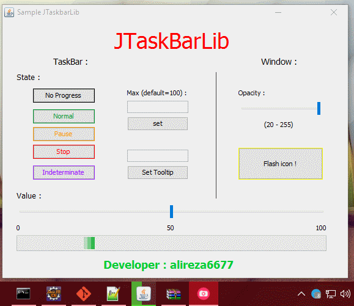
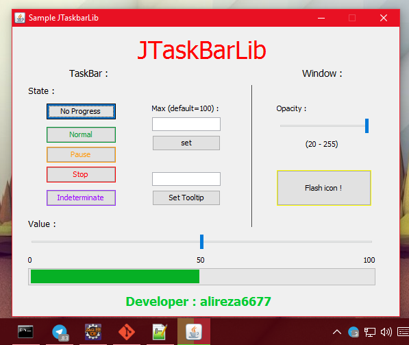
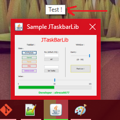
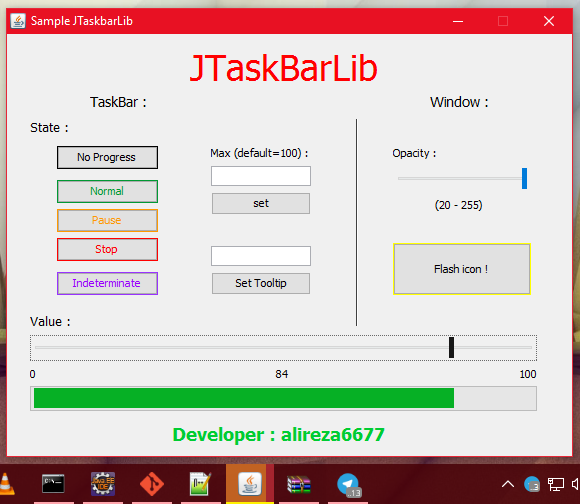
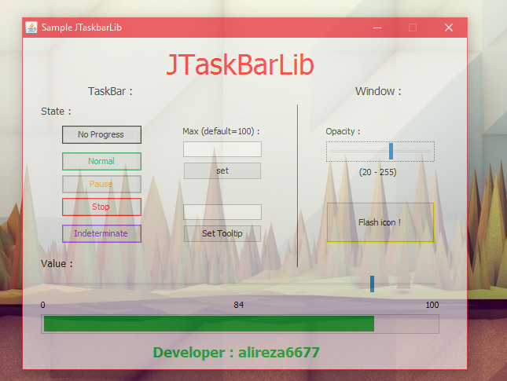

# JTaskbarLib

The first library for using windows Taskbar and window features in Java

# Requirements

Windows 7 , 8 , 8.1 , 10

java 7+

# How to use

First add library source files to your project then make sure user uses windows and then initialize the controller in your JFrame :

```java
JTaskbarController controller;
if(System.getProperty("os.name").contains("Windows")){
	//System.err.println("This library works only in windows 7,8,8.1,10 + ...");
	
	//in JFrame : (Don't forget to set a title for JFrame first)
	setTitle("Sample JTaskbarLib");
	controller = new JTaskbarController(this);
}
```

You can set the values in runtime (even opacity!):

```java
controller.setProgressState(JProgressState.NO_PROGRESS);
controller.setProgressState(JProgressState.STOP_ERROR);
controller.setProgressState(JProgressState.PAUSE);
controller.setProgressState(JProgressState.INDETERMINATE);
controller.setProgressState(JProgressState.NORMAL);

controller.setProgressValue(50);
controller.setThumbnailTooltip("Test !");
controller.flashWindow();
controller.setWindowOpacity(180); // (0 - 255)

```
# Download Library
[Download](https://github.com/alireza6677/JTaskbarLib/raw/master/dist/JTaskbarLib.jar)

# Screenshots








# How to compile c++ code in windows

```bash
g++ --shared -o JTaskbar.dll dll.cpp -lole32  -luuid
```

# Licence
JTaskbar is licenced under [BSD](https://github.com/alireza6677/JTaskbarLib/blob/master/LICENCE) license
